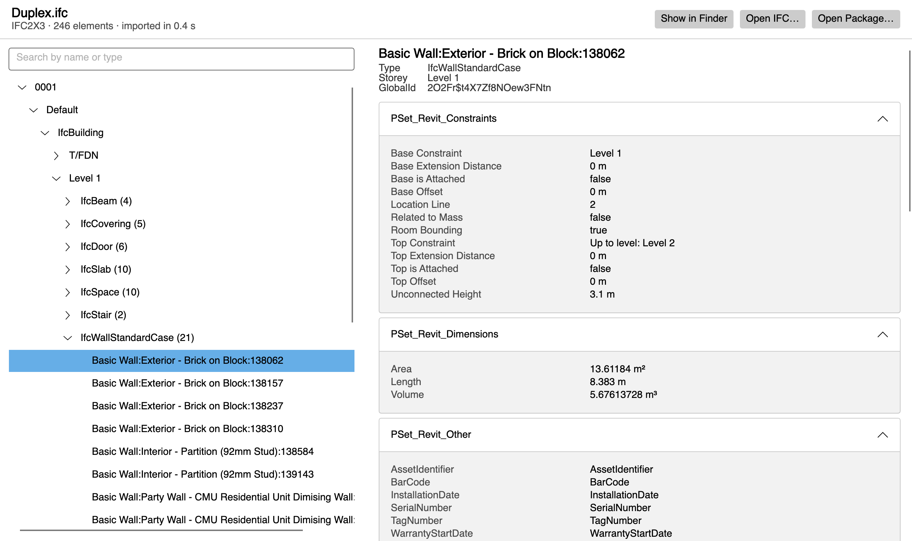

# Plumb

[](https://github.com/sburdenko/plumb/actions/workflows/ci.yml)

Desktop viewer for IFC building models. Open an `.ifc` file, browse its spatial structure and the properties of every element, and keep the result, 3D geometry included, as a `.plumb` package that reopens in milliseconds.

```
              ________________________
             /                       /|    IfcProject "0001"
            /                       / |    └── IfcSite "Default"
    _______/_______________________/  |        └── IfcBuilding
    |      |                       | /|            ├── Roof
    |      |  Roof                 |/ |            ├── Level 2
    |      |_______________________|  |            ├── Level 1
    |      |                       | /|            │   ├── IfcDoor (6)
    |      |  Level 2              |/ |            │   ├── IfcStair (2)
    |      |_______________________|  |            │   ├── IfcWallStandardCase (21)
    |      |                       | /|            │   └── + 5 more types
    |      |  Level 1              |/ |            └── T/FDN
    |      |_______________________|  |
    |      |                       | /
   _|_     |  T/FDN                |/
   \ /     |_______________________|
    V
 ~~~~~~~~~~~~~~~~~~~~~~~~~~~~~~~~~~~~~~~~
```
<picture>
  <source media="(prefers-color-scheme: dark)" srcset="docs/plumb-dark.png">
  
</picture>

## Features

- Opens IFC2X3 and IFC4 files by drag and drop or from a file dialog.
- Shows the spatial structure: project, site, building and storeys sorted by elevation, with elements grouped by IFC type. Parts of aggregates, such as stair flights, appear under their parent element and keep its storey.
- Shows instance and type property sets and quantity sets for the selected element. Instance values override type values.
- Resolves units from the project's unit assignment when a property does not specify its own.
- Filters the tree by element name or IFC type.
- Converts the geometry to binary glTF (`model.glb`) with IfcOpenShell's IfcConvert. Every mesh node is named by its IFC GlobalId, so a 3D viewer can map a click back to the element and its properties.
- Saves every import as a `.plumb` package next to the source file. Opening the package skips IFC parsing entirely. When that folder is read-only, the model still opens and the app shows why it was not saved.
- Imports in the background with progress and cancellation. A cancelled or failed import never leaves a half-written package behind.
- Keeps the model when a secondary step fails: if the package cannot be saved, or IfcConvert is missing, fails or times out, the tree and properties still open and the app shows why.

| Duplex sample: 2.4 MB, 246 elements, 12,713 property values | Time |
|---|---|
| Import from IFC, including geometry | ~1.3 s |
| of which IfcConvert | ~1.1 s |
| Open the saved package | ~15 ms |

Measured on Apple Silicon with a Release build in a warm process.

## Architecture

Every project does one job and references only what that job needs. Each box depends only on the boxes below it.

```
                            ┌───────────────────────┐
                            │       Plumb.App       │
                            │  Avalonia desktop UI  │
                            └───────────┬───────────┘
                                        │
                            ┌───────────┴───────────┐
                            │      Plumb.Import     │
                            │   runs the pipeline   │
                            └───────────┬───────────┘
            ┌───────────────────────────┼───────────────────────────┐
            │                           │                           │
┌───────────┴───────────┐   ┌───────────┴───────────┐   ┌───────────┴───────────┐
│       Plumb.Ifc       │   │     Plumb.Geometry    │   │     Plumb.Package     │
│  IFC file to records  │   │ IFC file to model.glb │   │   records to .plumb   │
│        [ xBIM ]       │   │     [ IfcConvert ]    │   │       [ SQLite ]      │
└───────────┬───────────┘   └───────────┬───────────┘   └───────────┬───────────┘
            │                           │                           │
            └───────────────────────────┼───────────────────────────┘
                                        │
                            ┌───────────┴───────────┐
                            │       Plumb.Core      │
                            │  shared records, tree │
                            │     netstandard2.1    │
                            └───────────────────────┘
```

| Project | Job | Key library |
|---|---|---|
| `Plumb.Core` | Records, import results, the element tree and search. Targets netstandard2.1, so any .NET runtime can reference it, Unity included. | |
| `Plumb.Ifc` | Reads an IFC file into element and property records. | xBIM |
| `Plumb.Geometry` | Runs IfcConvert to write `model.glb`, with a timeout, and stops it on cancel. | IfcConvert, as a separate process |
| `Plumb.Package` | Writes records into a `.plumb` folder and reads them back. | SQLite |
| `Plumb.Import` | Runs the steps in order, reports progress, turns every failure into a result. | |
| `Plumb.App` | Drag and drop, tree, property panel. | Avalonia |

xBIM, IfcConvert and SQLite each appear in exactly one project, so any of them can be replaced without touching the rest.

### Import pipeline

```
Duplex.ifc
   |
   |-- 1  validate   extension and ISO-10303-21 header            Plumb.Ifc
   |-- 2  read       spatial structure, properties, units         Plumb.Ifc
   |-- 3  geometry   IfcConvert writes model.glb into the draft   Plumb.Geometry
   |-- 4  write      database, index and manifest into the draft  Plumb.Package
   '-- 5  publish    rename the draft to Duplex.plumb             Plumb.Import
                     (an existing package is replaced only here)
```

The draft is a dot-prefixed folder next to the target. Cancelling or failing at any step deletes it and leaves an existing package untouched; cancelling during step 3 also stops IfcConvert. Because the draft sits in the same folder as the target, publishing is a rename, not a copy.

### Package format

```
Duplex.plumb/
|-- manifest.json   format version, source name and SHA-256, schema, element count, import time
|-- model.sqlite    elements and properties tables, properties indexed by GlobalId
|-- elements.json   id, type, name and storey of every element, for viewers without SQLite
'-- model.glb       binary glTF, one node per element, named by IFC GlobalId
```

The manifest is written last, so a folder without one was never finished. Readers check its format version before touching the database. When geometry could not be built, the manifest records why, so a reopened package shows the same reason.

### Design decisions

- **Errors are values.** The pipeline returns `ImportResult.Success` or `ImportResult.Failure` with an `ImportError` code and never throws for expected failures. xBIM wraps exceptions thrown from its progress callback, so cancellation is detected from the token rather than the exception type.
- **Secondary steps are states, not errors.** A successful import carries `PackageState.Saved` or `NotSaved`, and a saved package carries `GeometryState.Built` or `NotBuilt`. The UI reads the warning from that state; nothing is a boolean flag.
- **External tools run as separate processes.** IfcConvert (LGPL) is started per import with a time limit, its output is drained while it runs, and its whole process tree is killed on cancel or timeout.
- **Window states are types.** Empty, importing and loaded are separate view models, and the main view model swaps between them instead of toggling flags.
- **Flat records, tree on demand.** Import produces two flat lists keyed by IFC GlobalId, which map one to one onto the SQLite tables. The tree is built from parent ids, and search returns a new pruned tree without touching the original.
- **No Windows-only storage.** Models open with xBIM's `MemoryModel`, because the default `IfcStore` provider may pick the Esent database, which only runs on Windows.
- **Locale-independent numbers.** Values are written with the invariant culture and 10 significant digits, so Revit's `17.38299999999997` becomes `17.383` on any system.

## Getting started

Requires the .NET 10 SDK. Developed on macOS (Apple Silicon); CI builds and tests on macOS, Windows and Linux.

```bash
tools/fetch-ifcconvert.sh
dotnet run --project src/Plumb.App
```

`fetch-ifcconvert.sh` downloads the pinned IfcConvert build for your OS and checks its SHA-256; the build copies it next to the app. Without it the app still runs and shows that 3D geometry was not built.

To open a file or package on start, pass its path:

```bash
dotnet run --project src/Plumb.App -- path/to/model.ifc
```

## Tests

```bash
samples/fetch-samples.sh
dotnet test
```

The suite imports the Duplex architecture model and checks the tree, storey order, units and property integrity. It writes and reopens packages, replaces them, cancels mid-write and verifies that no draft is left behind. With the real IfcConvert it checks that every glTF node is an element of the package, that a timeout or cancel stops the process, and that a missing converter still loads the model.

The Duplex model is not stored in the repository because its source publishes no license. `fetch-samples.sh` downloads it from a pinned commit of [youshengCode/IfcSampleFiles](https://github.com/youshengCode/IfcSampleFiles) and verifies its SHA-256.

## Built with

.NET 10, Avalonia 12, CommunityToolkit.Mvvm, [xBIM Essentials](https://github.com/xBimTeam/XbimEssentials) 6, [IfcOpenShell](https://github.com/IfcOpenShell/IfcOpenShell) IfcConvert 0.9, Microsoft.Data.Sqlite, NUnit.

## License

MIT. Third-party components keep their own licenses; see [THIRD-PARTY-NOTICES.md](THIRD-PARTY-NOTICES.md).
